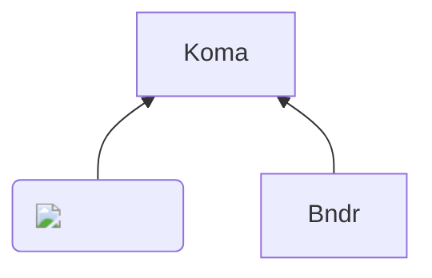

# Getting Started

Gcnc is a JavaScript library for controlling CNC machines and other digital fabrication devices.

Key features:

- Multiple protocol support
  - [Grbl](https://github.com/grbl/grbl)-like protocol, including [Grbl_Esp32](https://github.com/bdring/Grbl_Esp32) and [FluidNC](http://wiki.fluidnc.com/)
  - [Bambu Lab](https://bambulab.com/) (Node.js only)
- Works in both Node.js and browsers
- Built on [Streams API](https://developer.mozilla.org/en-US/docs/Web/API/Streams_API)
- Implemented as ES modules
- Full [TypeScript](https://www.typescriptlang.org/) support
- Available as an NPM package

Gcnc provides a unified API that abstracts away protocol and platform differences, making it easy to develop applications across different environments.

## Installation

```bash
npm install gcnc
```

## Quick Start

### Node.js

```typescript
import {SerialGrblCNCDevice} from 'gcnc'

const device = new SerialGrblCNCDevice('/dev/tty.usbserial-0001')

await device.open()

await device.send('G90') // Set absolute positioning
await device.send('G0 X0 Y0 Z0') // Move to home position

device.on('status', status => {
	console.log('Machine Status:', status.state)
	console.log('Position:', status.position)
})

await device.close()
```

### Browser (WebSerial)

```typescript
import {WebSerialGrblCNCDevice} from 'gcnc'

const port = await navigator.serial.requestPort()
const device = new WebSerialGrblCNCDevice(port)

// Rest of the code is similar to Node.js example
```

### WebSocket

FluidNC supports G-code transmission over WebSocket. However, in modern web browsers, insecure WebSocket connection is prohibited when using HTTPS connections, requiring configuration for each site.

 - Reference: [Allowing insecure WebSocket connections | Damir's Corner](https://www.damirscorner.com/blog/posts/20210528-AllowingInsecureWebsocketConnections.html)


```typescript
import {openWebSocketSerialPortDevice} from 'gcnc'

const device = await openWebSocketSerialPortDevice('ws://fluidnc.local:81')

// Rest of the code is similar to Node.js example
```

### Bambu Lab

FluidNC supports Bambu Lab's proprietary protocol only in Node.js.

```typescript
import {CNCDeviceBambu} from 'gcnc'

const device = new CNCDeviceBambu({
	host: '10.0.1.6',
	accessCode: '1234567890',
	serialNumber: '1234AA567890',
})
```


